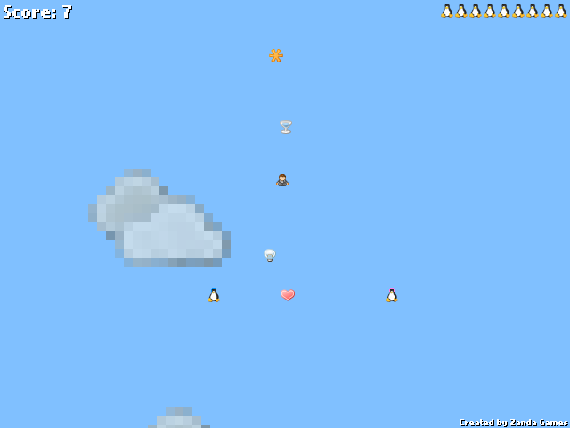

Penguins vs Aliens
==================

When Alice and Bob the two penguins were married, the priest gave them the ring of love and said: "It's dangerous to go alone! Take this!"

Little did they know that they were destined to be heroes... Until the aliens came and attacked Earth.

You can move them with the Arrow keys or WASD, and change the distance between them with JK.

And don't forget: love trumps aliens!

Penguins vs Aliens was created by [Andras Nemeth](https://github.com/cu2) in 2011 for the 48 hours [Ludum Dare 20](http://ludumdare.com/compo/ludum-dare-20/) competition (theme: It's Dangerous to go Alone! Take this!).

Music by [Casiokids](http://www.last.fm/music/Casiokids/_/Fot+i+hose)

Graphics by [famfamfam.com: Silk Icons](http://www.famfamfam.com/lab/icons/silk/)

Dependencies for compilation:
* [Flex 3.4.1](http://opensource.adobe.com/wiki/display/flexsdk/Flex+SDK) (probably works with other Flex v3 subversions)
* [Flixel 2.35](http://flixel.org/) (probably works with other Flixel v2 subversions)
